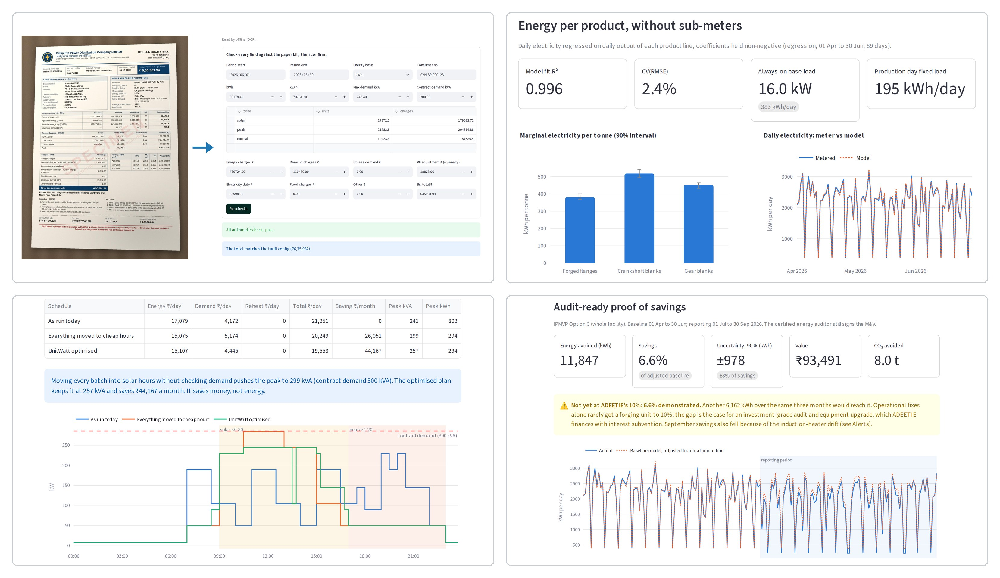

# UnitWatt

A software-only energy and carbon ledger for Indian MSME factories: the working prototype for
Challenge 4 (Smart Manufacturing for Indian MSMEs).

Most small factories see one monthly electricity bill and cannot say how much energy or carbon
goes into each unit they make. UnitWatt turns the paperwork a factory already has (electricity
bills, meter load surveys, fuel purchases, production registers) into four outputs:

1. **Energy per unit of product**, tracked daily, with an alert when it drifts.
2. **A tariff-aware production schedule** that moves flexible loads into cheaper time-of-day hours
   without creating a new demand peak.
3. **Audit-ready proof of savings** against a statistically valid baseline (IPMVP Option C), the
   evidence ADEETIE asks for.
4. **Product-level embedded emissions** for buyers and EU CBAM reporting.

No new hardware is needed.

## Architecture


Every module reads one daily ledger. The energy model fitted on it is reused as the savings
baseline, to split emissions across products, and as the expectation the drift alarm checks
against. The tariff engine reprices bills and prices every 15-minute slot for the scheduler.
Dashed boxes are built but not live-tested or use placeholder values; dotted boxes are planned.

## Run it

```bash
python -m venv .venv && source .venv/bin/activate
pip install -r requirements.txt

streamlit run app.py              # the dashboard, including a WhatsApp bot simulator
python -m unitwatt                # the same pipeline from the command line; writes reports to data/generated/
python -m unitwatt.bot chat       # chat with the bot in the terminal, as the owner, supervisor or accountant
uvicorn unitwatt.server:app       # the WhatsApp webhook and REST API (see "The WhatsApp bot")
pytest                            # 104 tests
python -m unitwatt.extract_eval   # score bill reading against the sample bills, field by field
```

Copy `.env.example` to `.env` for keys and settings; every one of them is optional.

Everything runs offline and free. No paid API is needed anywhere.

### Reading bill photos and PDFs (free)

| Reader | Needs | Good for |
|---|---|---|
| **Offline** (default) | Nothing | The PDF's own text layer, or RapidOCR for scans and phone photos, then a parser that finds each field by the labels DISCOM bills print. The bill never leaves the computer. |
| **Google Gemini, free tier** | `GEMINI_API_KEY` from [aistudio.google.com](https://aistudio.google.com/apikey), no card | Unfamiliar layouts and handwritten registers. Google may use free-tier uploads to improve its models, so send it specimen bills, or real ones only with the owner's consent. |
| Groq or OpenRouter free models | `GROQ_API_KEY` or `OPENROUTER_API_KEY` | The same, as alternatives |
| Ollama on your own machine | `UNITWATT_READER=ollama` and a vision model (`ollama pull qwen2.5vl:7b`) | Free and private, if the laptop can run it |

The online readers use the OpenAI-compatible chat API, so any similar endpoint works through
`UNITWATT_BASE_URL`, `UNITWATT_MODEL` and `UNITWATT_API_KEY`. `UNITWATT_READER` picks the
reader; by default it is the first free API with a key set, and otherwise offline. Free model
names change often: if a preset model is retired, set `UNITWATT_MODEL`.

Whatever the reader, every bill goes through the arithmetic checks and a confirmation screen
before it reaches the ledger.

**Tested:** the offline reader read 27 test bills correctly. They are six months of the demo
bill, each as a PDF, a clean scan and a phone photo, plus four more layouts as a PDF and a photo:
- a kVAh bill with a PF rebate
- a dense state-utility bill with meter readings, excess demand and a fuel cost adjustment
- a monospace computer printout
- a Hindi and English bill

The photos include angled, noisy, low-resolution and sideways shots. Every number on every bill
was exact. The only misreads were spaces and an I/1 in the printed tariff-category text. The online readers are
tested against a local stand-in for the API (request format, the JSON retry, rate-limit and key
errors), but have not yet been run against Gemini itself. To do that, set `GEMINI_API_KEY` and
run `python -m unitwatt.extract_eval --reader gemini`.

`data/sample_bills/` has the test bills and the ground-truth JSON for each. Every utility,
name and number on them is made up, so they are not real factory data. The first two layouts
carry a SPECIMEN watermark. The three newer ones have only a small test-bill footer, so they
look like real bills.

## The WhatsApp bot

The owner, supervisor and accountant use UnitWatt where they already are: WhatsApp. One engine
(`unitwatt/bot/core.py`) answers on WhatsApp, on Telegram, in the terminal and in the dashboard's
*WhatsApp bot* tab, in Hindi or English.

| Send | Gets back | Who may |
|---|---|---|
| `hi` | A menu of what this person can do, with reply buttons | Everyone registered |
| `1` | This month's report: money that could have been kept, savings so far, energy per tonne, the top action, alerts. `1` again gives the top three actions with cost and payback | Owner, accountant |
| `2` | Asks for consent, records it in the audit trail, then sends the savings report as a PDF for the bank or ADEETIE auditor | Owner |
| `3` | Tomorrow's batch plan from the scheduler, with the saving and the peak | Owner, supervisor |
| `4` | Drift alarm and penalties on the latest bill | Owner, supervisor, accountant |
| `फ्लेंज 1.5 टन, crank 1.2t, gear 1400 kg, 2 shifts` | The parsed entry to confirm; saved on *Save* | Owner, supervisor |
| A photo or PDF of the bill | The bill read offline, arithmetic checks, penalties found (for example a ₹19,959 power-factor penalty); saved on *Save* | Owner, accountant |
| A voice note | Transcribed with Whisper, then handled like typed text | Owner, supervisor |
| `हिंदी` / `English` | Switches language | Everyone |

People and roles come from the factory profile (`contacts:` in `config/factories/*.yaml`); add real
numbers in `UNITWATT_CONTACTS=phone:role:name,...` so they never enter the repo. Numbers that are not
registered get a polite refusal and nothing else. Everything people send is kept in a SQLite store
(`data/unitwatt_bot.sqlite`) and every file is hashed into the audit trail.

**Try it without any accounts:** the dashboard's *WhatsApp bot* tab, or `python -m unitwatt.bot chat`.

**Connect WhatsApp (Meta Cloud API, free to start):**

1. At developers.facebook.com create an app, add the *WhatsApp* product, and note the test number's
   *Phone number ID* and the temporary *access token*. Add your own number as a test recipient.
2. Set `WHATSAPP_TOKEN`, `WHATSAPP_PHONE_NUMBER_ID`, `WHATSAPP_VERIFY_TOKEN` (any string you choose) and
   `WHATSAPP_APP_SECRET` (App settings → Basic) in `.env`, and add your number to `UNITWATT_CONTACTS`.
3. Run `uvicorn unitwatt.server:app --port 8000` and expose it over HTTPS, for example with
   `cloudflared tunnel --url http://localhost:8000` or `ngrok http 8000`.
4. In the app's WhatsApp → Configuration, set the callback URL to `https://<host>/webhook/whatsapp`, enter
   the same verify token, and subscribe to the `messages` field.
5. Send `hi` to the test number. `GET /health` shows what is configured.

**Connect Telegram (free, no public URL needed):** create a bot with @BotFather, set
`TELEGRAM_BOT_TOKEN`, and run `python -m unitwatt.bot telegram`. Each person shares their phone number
once, and the bot then treats them exactly as on WhatsApp.

**Voice notes:** set `GROQ_API_KEY` for Groq's free hosted Whisper, or run a Whisper server on your own
machine that speaks the OpenAI audio API and set `UNITWATT_STT=local`, so audio never leaves it.

**REST API:** set `UNITWATT_API_TOKEN` and send it as `X-API-Key` to use `/api/report`, `/api/schedule`,
`/api/production`, `/api/bills/read` and `/api/data`. Without the token the REST API stays off, so
exposing the webhook never exposes the data.

**Tested:** the bot engine, roles, confirmations, consent and PDF report, the WhatsApp webhook
(handshake, signature check, media download, reply buttons, document upload, repeated deliveries
answered once), the REST API and Telegram (number linking, buttons, photos, polling) all run in the test
suite against local stand-ins for Meta's, Telegram's and Groq's servers. None of them has yet been run
against the real services, because this repository's build environment cannot reach them.

## The demo factory

There is no factory partner yet, so the prototype runs on a **synthetic forging unit**,
"Shakti Forge Works, Patna": 48 workers, three product lines (flanges, crankshaft blanks, gear
blanks), 300 kVA contract demand, billed under the Bihar HT industrial ToD structure (120% of the
base rate in the evening peak, 80% in solar hours). It has six months of 15-minute meter data,
daily registers, fuel invoices and a generator log. The data has the faults the product is meant
to find planted in it:

| Planted in the data | What UnitWatt finds |
|---|---|
| 16 kW running at night and on Sundays (air leaks, machines left on) | Idle load = 8.1% of energy (P9) |
| Billet heating in the evening peak | ₹44,000/month saving from the optimised schedule (P12) |
| Everything restarted together after a power cut on 19 May | Excess-demand penalty traced to 10:30 on 19 May (P10) |
| Capacitor bank failed in June | ₹20,000 power-factor penalty (P10) |
| Owner acts on 1 July: half the idle load cut, heating moved to solar hours | 11,847 kWh avoided, 6.6% ±8%, all M&V checks pass (P15) |
| Induction-heater lining starts wearing on 31 Aug | CUSUM alarm on 12 Sep (P11) |
| Meter export gaps, duplicate rows, two missing register pages | Gaps filled from the bill and labelled estimated; data-quality score (P3, P6, P7) |

The regression recovers the hidden per-product energy (380 / 520 / 450 kWh/t) to within 1%
without sub-meters, and the impact-model tab reproduces the deep dive's numbers exactly:
₹51,200 a month, ₹6.14 lakh and 19.4 tCO₂ a year for one unit, and ₹61.4 crore for 1,000 units.

The result is deliberately honest: zero-capex actions get this unit to **6.6%, short of ADEETIE's
10%**. The dashboard shows the gap in kWh and treats it as the case for an investment-grade audit.

## The dashboard



Slide-ready screenshots of each tab, taken from the running app, are in `docs/demo/`.

| Tab | For | What it shows |
|---|---|---|
| Owner | Owner | Money that could have been kept this month, top three actions, the WhatsApp message in English or Hindi |
| WhatsApp bot | Owner, supervisor, accountant | The bot itself, simulated: chat as each person, send bill photos, PDFs and voice notes, see what was saved |
| Bill check | Owner, accountant | The ten-minute bill check, contract-demand sizing, bill photo/PDF reading (offline or a free API) with arithmetic checks and confirmation |
| Energy per product | Supervisor, auditor | Regression SEC with 90% intervals, 15-minute load heatmap, idle-waste analysis |
| Schedule | Supervisor | CP-SAT schedule against today's schedule and a naive shift, with the owner's shift limits and a peak cap |
| Savings proof | Banker, auditor, scheme officer | IPMVP Option C savings, ASHRAE 14 uncertainty, ADEETIE test, consent-gated report download |
| Carbon & CBAM | Export buyer, EU importer | Scope 1, 2 and precursor emissions per tonne, CBAM coverage by HSN, default values vs actuals |
| Alerts | Owner, electrician | CUSUM and EWMA drift monitor with a plain-language explanation |
| Data & audit | Everyone | Data-quality score, meter gaps, fuel stock-flow, the daily ledger, SHA-256 audit chain, 30-second chat entry |
| Impact model | Judges | The deep dive's assumptions as inputs, with the scaling scenario and half-shift sensitivity |

## How the code maps to the deep dive

| Problem | Module | Approach |
|---|---|---|
| P1 Bills in many layouts | `schemas.py`, `offline_extract.py`, `extract.py` | Fixed Pydantic schema; filled offline (PDF text or OCR plus label rules) or by a free vision model; zone-sum, kVAh ≥ kWh and line-item checks; confirmation screen |
| P2 Handwritten registers | `ingest.parse_daily_entry`, `extract.extract_register` | 30-second chat entry (Hindi, English, Devanagari digits, kg/quintal); register photos through a free vision model |
| P3 Meter CSV formats | `ingest.read_load_survey` | One adapter per format into a standard 15-minute series; gaps flagged, never silently filled |
| P4 Purchases ≠ consumption | `ingest.fuel_consumption` | Opening + purchases − closing, diesel reconciled with the generator log |
| P5 Incompatible units | `config/factors.yaml` | Everything to MJ and kWh-eq; every factor carries its source; supplier overrides |
| P6, P7 One trustworthy ledger | `ledger.py` | Daily table; bill residual spread over gap days by production; visible data-quality score |
| P8 Energy per product | `analytics.fit_energy_model` | Non-negative least squares, block-bootstrap intervals, benchmark prior when data is short |
| P9 Idle waste | `analytics.idle_analysis` | Non-production-hours load against an essential-load floor, in rupees |
| P10 Tariff complexity | `tariff.py`, `config/tariffs/*.yaml` | Versioned tariff configs; bill simulator and repricer; bill forensics; contract-demand sizing |
| P11 Slow degradation | `analytics.drift_monitor` | CUSUM and EWMA on residuals from a re-baselined model |
| P12 Shifting creates peaks | `scheduler.py` | OR-Tools CP-SAT: energy + demand + excess + reheat cost; machine, order and shift constraints |
| P13 Too many recommendations | `opportunities.rank_opportunities` | Ranked by ₹/year, confidence and payback; top three shown |
| P14 Plain language | `messages.py` | Template-constrained: every number comes from a computed field (tested) |
| P18 Reach owners where they are | `bot/`, `server.py` | One bot engine behind WhatsApp (Cloud API webhook), Telegram and a simulator; roles per phone number; voice notes through Whisper |
| P15 Proof of savings | `mv.py` | IPMVP Option C, CV(RMSE), NMBE, R², ASHRAE 14 fractional savings uncertainty |
| P16 Product emissions, CBAM | `emissions.py` | Scope 1, 2 and precursors allocated with P8, reconciling to the meter; CBAM scope by HSN |
| P17 Traceability | `audit.py`, `report.py`, `report_pdf.py` | SHA-256 per document, hash-chained append-only log, source appendix on every report (HTML and PDF) |
| P19 Sensitive data | `audit.record_consent`, `bot/core.py` | Explicit consent recorded before any report is shared; the bot answers only registered numbers, each within its role; the REST API needs a token |
| P20 Every state differs | `config/` | Tariffs, sectors and factories are data, not code |

## What is real and what is illustrative

- **From the deep dive's cited sources:** the Bihar ToD multipliers, Kerala's 75% billing-demand
  floor and 50% excess surcharge, the CEA grid factor (0.675 tCO₂/MWh), IPCC fuel factors, the
  CBAM scope rules, and the LBNL and ASHRAE M&V thresholds.
- **Placeholders, marked `illustrative` in the configs and the UI:** energy and demand rates, ToD
  windows, PF slabs, electricity duty, cluster benchmarks, billet precursor emissions and EU default
  values. Check them against the current tariff order and BEE mapping report before quoting a
  rupee figure to a real factory.
- **All factory data is synthetic.** Swapping in one real unit's bills is the most valuable next step.

## Next steps toward the pilot

- Load one real factory's bills: add its DISCOM tariff as a YAML file and its profile under
  `config/factories/`.
- Put the WhatsApp bot on a verified business number and test it with the pilot's owner and supervisor.
- Spoken replies in Hindi through Bhashini or AI4Bharat text-to-speech (voice notes in already work).
- PostgreSQL/TimescaleDB with row-level security in place of SQLite, and re-running the analysis when
  the bot saves new production or bills.
